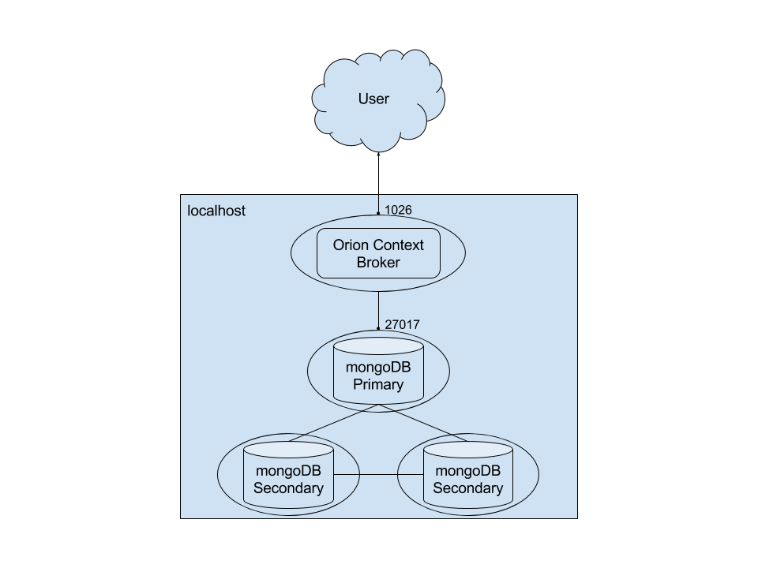
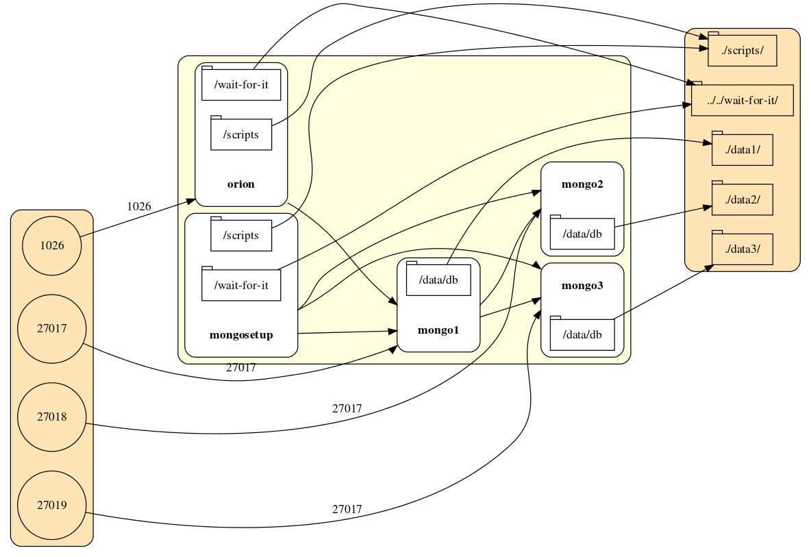

# Simple Scenario

##### Introduction
This simple recipe triggers an [Orion Context Broker](https://github.com/telefonicaid/fiware-orion/blob/master/README.md) instance backed with a [MongoDB](https://docs.mongodb.com) instance.

Both services will be running in docker containers, defined in the *simple/docker-compose.yml* file.

Data will be persisted, by default, in a local folder called data. However, this can changed by editing the value of *DATA_PATH* variable in the _.env_ file.

##### How to use

Optionally, you can modify *.env* file (or even _docker-compose.yml_) according to your needs. Then simply run:

    $ cd simple/
    $ docker-compose up -d

##### How to check
Simply run the following command and it should return info about orion.

    $ curl localhost:1026/version

# Orion in HA

The goal of this recipe is to allow developers instantiate N replicas of an [Orion Context Broker](https://github.com/telefonicaid/fiware-orion/blob/master/README.md) in a docker swarm cluster.

##### How to run it locally (no cluster)

    $ cd ha

    # Optionally, modify _.env_ file (or even _docker-compose.yml_) according to your needs.

    $ docker-compose up -d

##### How to run in cluster

###### TODO: Turn this into a docker-compose file once the compose-swarm integration is ready.

To simplify, the following instructions will be using a simple docker swarm created with the scripts provided in the swarm folder. But of course, in practice, your swarm deployment will be different, depending on your chosen infrastructure.

    $ sh ../tools/create-swarm.sh

Now, from the swarm-master node, create the networks:

    $ eval $(docker-machine env node-1)
    $ docker network create --driver overlay proxy
    $ docker network create --driver overlay hacb

Now it's time to create a swarm listener service, which will notify the proxy when new services
are created/removed so as to dynamically update the proxy configuration.

    $ docker service create --name swarm-listener \
        --network proxy \
        --mount "type=bind,source=/var/run/docker.sock,target=/var/run/docker.sock" \
        -e DF_NOTIF_CREATE_SERVICE_URL=http://proxy:8080/v1/docker-flow-proxy/reconfigure \
        -e DF_NOTIF_REMOVE_SERVICE_URL=http://proxy:8080/v1/docker-flow-proxy/remove \
        --constraint 'node.role==manager' \
        vfarcic/docker-flow-swarm-listener

Note that services might take some time until fully deployed. So, please wait until all the requested replicas are ready before creating new services. This can be done running:

    $ docker service ls

Now create the proxy service.

    $ docker service create --name proxy \
        -p 80:80 \
        -p 443:443 \
        -p 1026:1026 \
        --network proxy \
        -e MODE=swarm \
        -e LISTENER_ADDRESS=swarm-listener \
        vfarcic/docker-flow-proxy

Then the database (be patient until it's ready).

    $ docker service create --name mongo --network hacb mongo:3.2 --nojournal

And finally Orion, linking to mongo as usual.

    $ docker service create --name orion \
    --network hacb \
    --network proxy \
    --label com.df.notify=true \
    --label com.df.distribute=true \
    --label com.df.servicePath=/version \
    --label com.df.port=1026 \
    fiware/orion -dbhost mongo

Now let's query Orion from the proxy to check it's up and running:

    $ curl -i $(docker-machine ip node-1):1026/version

# DB in replica-set

This recipe aims to allow developers to instantiate an [Orion Context Broker](https://github.com/telefonicaid/fiware-orion/blob/master/README.md) instance backed with a [replica set](https://docs.mongodb.com/v3.2/replication/) of MongoDB instances.

All elements will be running in docker containers, defined in a docker-compose file.

The recipe's configuration as of now is more suitable for a __development environment__. It has some default values which you might be able to edit with ease.

The replicas will all be launched in the local environment, but nothing prohibits deploying replicas in different hosts, in fact, that would be more likely in a production deployment scenario.

If you are planning to use it in a __production environment__, further considerations need to be taken into account as show in the corresponding section.

##### How to use

    $ cd replica

    # Optionally, modify _.env_ file (or even _docker-compose.yml_) according to your needs.

    $ docker-compose up -d

Allow some time until things get connected before querying for content.

##### How it works

The way this work is pretty straightforward. To begin with, there are three mongo containers
that will be triggered (mongo1, mongo2, mongo3).

A fourth container (mongosetup) will wait for _mongo1_ to be ready and then execute the *setup_replica.sh* script to configure the replica set with the 3 mongo instances.

The fifth and last container will host Orion, who will be linked to the _mongo1_ container as its backend once its ready. It will execute *setup_orion.sh* to start Orion in the replicaset mode with enough timeout for the actual replica to be ready.

You can experiment different configurations, including timeouts, by editing the file _.env_ before calling docker-compose.

##### Troubleshooting
- If Orion fails to connect to the database try to restart it.

        $ docker restart orion

##### Important considerations

 - All nodes must be in the same network, in other words, reachable among them.
 - If you are running behind a firewall, make sure to keep traffic open for TCP at ports 1026 (Orion's default) and 27017 (Mongo's default)
